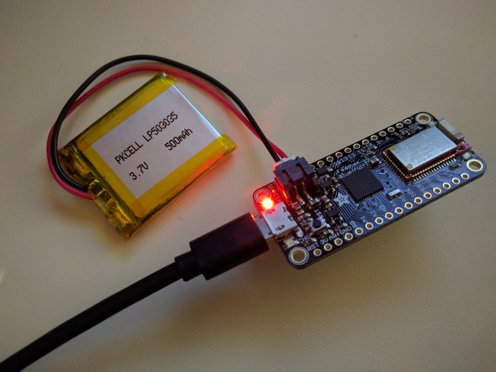
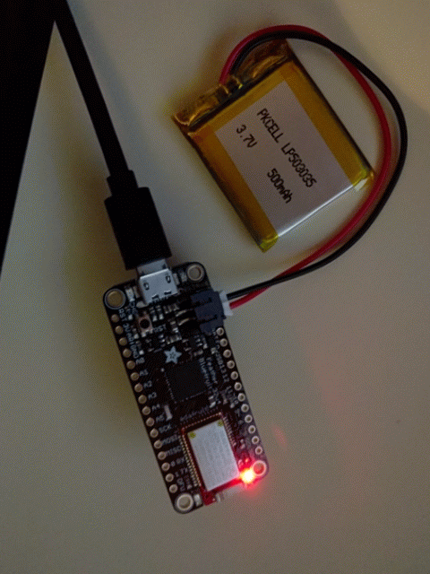
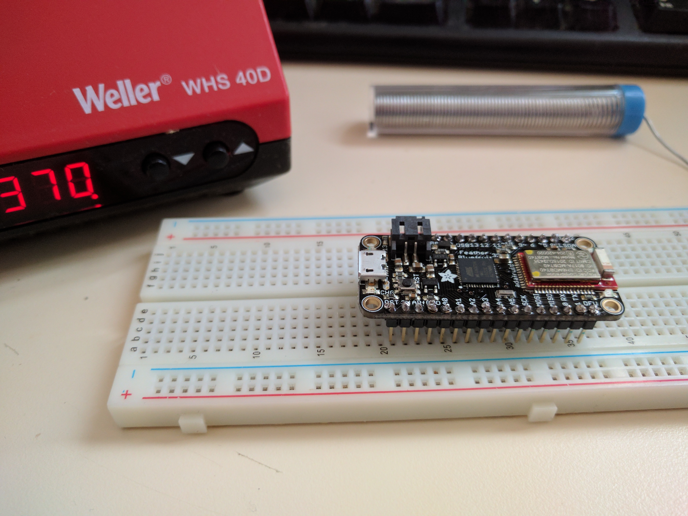
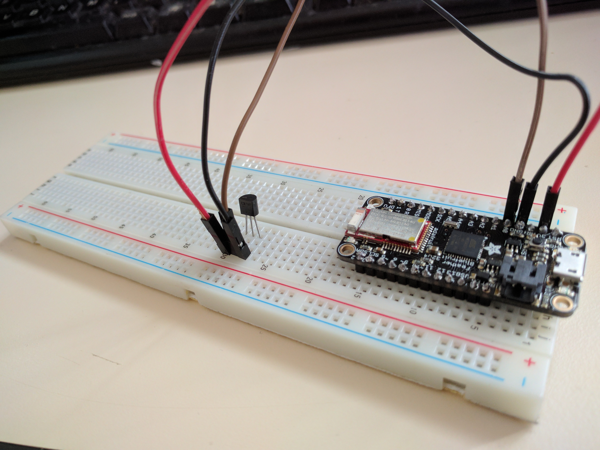

# Adafruit-Feather-32u4-Bluefruit-LE


## Getting started
- Tools > Boards Manager > Adafruit AVR Boards (Install)  
- restart editor  
- Select Adafruit Feather 32u4 board
- [Install Windows driver](https://github.com/adafruit/Adafruit_Windows_Drivers/releases/download/1.0.0.0/adafruit_drivers.exe)
- [Adafruit_BluefruitLE_nRF51 cpp library](https://github.com/adafruit/Adafruit_BluefruitLE_nRF51)

## Projects
### Blinking LED
[hello blink (source)](./hello-blink/)  
```c++
// the setup function runs once when you press reset or power the board
void setup() {
  // initialize digital pin 13 as an output.
  pinMode(13, OUTPUT);
}
 
// the loop function runs over and over again forever
void loop() {
  digitalWrite(13, HIGH);   // turn the LED on (HIGH is the voltage level)
  delay(2000);              // wait for a second
  digitalWrite(13, LOW);    // turn the LED off by making the voltage LOW
  delay(2000);              // wait for a second
}
```


### Soldering


### Adding a temperature sensor


### Getting TMP and Battery 
